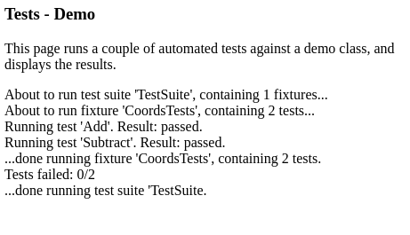

TestFramework
=============

An automated test framework in JavaScript.

Suggested Usage
---------------

One way in which the framework might be used is described below.

1. In the top level of the parent Git repository, create a new subdirectory
named "Tests".

2. Open a command prompt within the newly created "Tests" subdirectory
and run the following command from within it:

	git submodule add https://github.com/thiscouldbebetter/TestFramework Framework

3. Copy the file Tests.html from the top level of the newly created
"Framework" directory and paste it into the "Tests" directory.

4. Open the file Tests.html in a text editor.

5. Add "script" elements corresponding to the classes of the system under test.

6. Still in the .html, in the call to the TestSuite constructor, replace
the example test fixtures and tests with custom tests.

7. Open the .html file in a web browser that runs JavaScript.

8. Verify that all tests pass.
